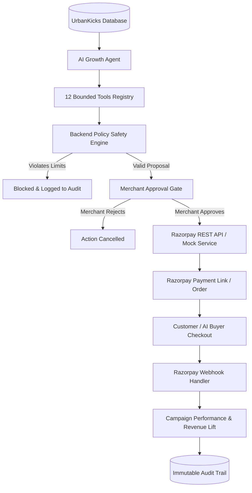

# RazorGrowth AI ⚡
### Autonomous AI Revenue & Growth Agent for Merchants
**Razorpay AI Builder Internship 2026 — Track 1: AI Growth & Agentic Commerce**

    

---

## 1. Executive Summary

**RazorGrowth AI** is an autonomous revenue optimization agent for merchants (demonstrated via **UrbanKicks**, a footwear and sports accessories store). 

Unlike generic chatbots that only provide text advice, **RazorGrowth AI closes the execution loop**:
1. Analyzes historical merchant sales, customer cohorts, and product attachment gaps.
2. Identifies high-probability revenue opportunities (e.g. cross-sell bundles, checkout drop-off recoveries).
3. Proposes bounded campaign parameters.
4. Enforces strict backend risk safety policies.
5. Gates money-affecting actions behind explicit merchant approval.
6. Executes approved actions directly via **Razorpay Test Mode APIs** (or fallback Mock Mode).
7. Tracks customer conversion and measures net revenue lift.
8. Maintains an immutable end-to-end audit trail.

---

## 2. Core Demo Loop

```text
Merchant Sales & Customer Data
             ↓
    AI Growth Agent Scan
             ↓
Finds Revenue Opportunity (Running Shoes → Sports Socks)
             ↓
Generates Bounded Recommendation (10% off bundle)
             ↓
Explains WHY & Predicts Impact (₹18K - ₹42K)
             ↓
Backend Policy Engine Check (Discount <= 15%, Budget <= ₹5k)
             ↓
Merchant Approval Gate Modal
             ↓
Execute via Razorpay (Payment Link / Order API)
             ↓
Customer Payment & Webhook Verification
             ↓
Measure Net Revenue Lift & Audit Log Update
```

---

## 3. Track 1 Alignment Matrix

| Track Requirement | RazorGrowth AI Implementation | Feature Component |
| :--- | :--- | :--- |
| **Grow Merchant Revenue** | Autonomous AI Agent scanning sales velocity, co-purchases, and cart abandonments. | AI Growth Agent & Opportunity Engine |
| **Agentic Commerce** | Machine-readable `/api/catalog` API allowing consumer AI Buyers to search, select, and purchase. | AI Buyer Assistant |
| **Explainable Money Actions** | Clear empirical evidence (72 footwear buyers, 15.2% socks attachment vs 28.0% benchmark). | Evidence & Reasoning Pipeline |
| **Bounded Execution** | Hard backend policy engine enforcing discount limits (15%), budget caps (₹5,000), and redemption limits (100). | Policy Engine |
| **Gated Approval** | Financial actions strictly require explicit click on interactive Approval Gate Modal. | Approval Gate Modal |
| **100% Auditable** | Immutable Audit Trail recording every analysis step, policy check, approval, and Razorpay API call. | Audit Trail System |
| **Graceful Error Handling** | Simulated API failure test mode with zero-charge recovery and idempotency keys (`act_*`). | Failure Simulation & Recovery |
| **Razorpay Integration** | Official REST APIs (`https://api.razorpay.com/v1`) for Payment Links & Orders with instant Mock fallback. | Razorpay Service |

---

## 4. Architecture Overview



---

## 5. Agent Tool Architecture

RazorGrowth equips the AI Agent with 12 bounded tools categorized into 3 strict permission tiers:

### READ (Safe - Auto Execution)
- `analyze_sales()` - Analyzes sales velocity and weekly revenue trends.
- `analyze_products()` - Inspects catalog margins, sales counts, and conversion rates.
- `analyze_customers()` - Evaluates customer segmentation and churn risk indicators.
- `get_payment_status()` - Fetches live payment status from Razorpay.

### PROPOSE (Recommendation Generation - No Financial Execution)
- `find_cross_sell_opportunities()` - Identifies product pairing gaps.
- `find_upsell_opportunities()` - Identifies premium upgrade paths.
- `analyze_checkout_dropoff()` - Analyzes high-value cart abandonment triggers.
- `estimate_revenue_impact()` - Calculates conservative revenue lift ranges.
- `prepare_campaign()` - Drafts bounded campaign parameters.
- `analyze_campaign_performance()` - Evaluates active campaign ROI.

### EXECUTE (Money-Affecting Actions - Gated by Merchant Approval)
- `create_payment_link()` - Generates Razorpay Payment Link.
- `create_order()` - Generates Razorpay Order.

---

## 6. Safety & Policy Engine Rules

The backend Policy Engine enforces hard merchant risk limits:
- `MAX_DISCOUNT_PERCENT` = 15%
- `MAX_CAMPAIGN_BUDGET` = ₹5,000
- `MAX_REDEMPTIONS` = 100
- `REQUIRE_APPROVAL_FOR_MONEY_ACTIONS` = true
- `ALLOW_LIVE_MODE` = false (Test / Mock Mode only)

If an AI tool invocation attempts to violate any rule (e.g., requesting a 50% discount), the policy engine immediately blocks execution and logs a policy rejection event in the Audit Trail.

---

## 7. Zero-Config Local Setup

The project runs out of the box with zero external database dependencies or required API keys.

```bash
# 1. Clone & Navigate to project directory
cd Razorpay

# 2. Install dependencies
npm install

# 3. Push SQLite database schema & seed UrbanKicks store data
npx prisma db push
npx tsx prisma/seed.ts

# 4. Start local dev server
npm run dev
```

Open [http://localhost:3000](http://localhost:3000) in your browser.

---

## 8. Environment Variables

Create `.env` file (pre-populated by default):

```env
DATABASE_URL="file:./dev.db"

# Optional: Real Razorpay Test Mode Keys
RAZORPAY_KEY_ID=""
RAZORPAY_KEY_SECRET=""
RAZORPAY_OFFER_ID=""
RAZORPAY_WEBHOOK_SECRET=""

# AI Provider Configuration (openai | gemini | rule_based)
AI_PROVIDER="rule_based"
OPENAI_API_KEY=""
GEMINI_API_KEY=""

# Mock Simulation Mode Toggle
RAZORPAY_MOCK_MODE="true"
```

---

## 9. 5-Minute Hackathon Demo Script

### Minute 1: Dashboard Overview
- Open Dashboard at `http://localhost:3000`.
- Show metrics: Total Revenue (₹4,82,400), Orders (1,284), AOV (₹1,742), Conversion (4.8%).
- Point out **AI Influenced Revenue** widget (₹1,42,300).

### Minute 2: Autonomous AI Scanning
- Click **"▶ Run Growth Analysis"** in the top header.
- Observe top opportunity: *Running Shoes → Sports Socks Cross-sell* (72 shoes buyers, 11 socks buyers, 15.2% attachment rate, ₹18K-₹42K potential).

### Minute 3: Conversational Growth Agent
- Navigate to **AI Growth Agent** (`/agent`).
- Click prompt button: *"Why did my revenue drop this week?"*.
- Review structured reasoning, risk rating, and click **"Prepare Action"**.

### Minute 4: Policy Validation & Approval Gate Execution
- Inspect the **Approval Gate Modal** displaying proposed bundle price (₹3,299), discount cap (10%), redemption limit (100), and policy validation check.
- Click **"Approve & Execute"**.
- View generated **Razorpay Payment Link** (`plink_mock_8F91X`).
- Click **"Open Checkout"** and click **"Simulate Payment"**.

### Minute 5: Audit Trail & AI Buyer (Agentic Commerce)
- Navigate to **Audit Trail** (`/audit`) to review complete immutable timeline (`AI Analysis` → `Merchant Approval` → `Policy Check` → `Razorpay Link` → `Payment`).
- Navigate to **AI Buyer** (`/ai-buyer`), ask *"I need running shoes under ₹3,000"*, and watch the consumer agent query `/api/catalog` and trigger order creation.

---

## 10. Tech Stack
- **Framework**: Next.js 14 (App Router)
- **Language**: TypeScript
- **Styling**: Tailwind CSS (Fintech Dark Palette), Lucide Icons
- **Analytics**: Recharts, Framer Motion
- **Database**: SQLite via Prisma ORM
- **Payment Gateway**: Official Razorpay REST APIs (`/v1/payment_links`, `/v1/orders`) & Mock Simulation Engine
